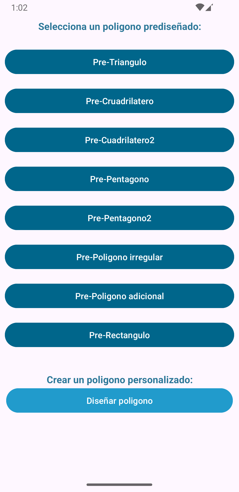
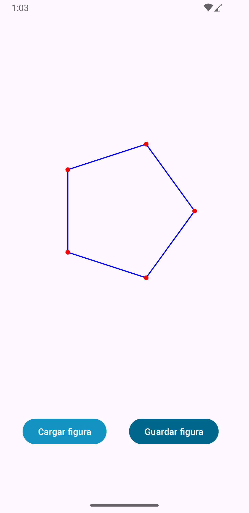

# ShapeGenerator.

_Test Android Developer - GCA_

## Construido con 🛠️

_Aplicacion movil, Android nativa, con Kotlin como lenguaje principal, bajo la arquitectura MVVM y consumo de API._

    Android API 24 (7.0)/ Kotlin 1.9.0
    MVVM
    API
    SQLite
    Retrofit

## Funcionamiento

_Al ejecutar la aplicación, se situará al usuario en una vista, compuesta por una serie de botones_
_que representan las figuras recuperadas desde la API:https://gca.traces.com.co/pruebamovil/api/polygons_

_La primera sección, cuenta con botoes que representan las figuras geometricas disponibles._
_La segunda sección, consta de un unico botón, que permite al usuario generar su propio polígono,_
_solicitando la cantidad de lados, y su escala para ser dibujado, mediante controles deslizantes._

_Una vez dentro de la vista de dibujo, se podrá observar la figura, compuesta de la representación de_
_los puntos de coordenadas, unidos por lineas que cierran la figura. _
_Los puntos o nodos, pueden ser modificdos realizando acciones touch, como arrastrar sobre el lienzo._
_Si se desea probar con otra figura, puede regresar a la vista de selección usando los botones back o gestos._

## Desarrollo

_Se eligió la arquitectura MVVM, y se procedio a generar el modelo de datos para gestionar los datos obtenidos._
_Se uso retofit para lograr realizar la peticiones y administrar el json recibido_
_Se creo el recyclerView y sus elementos para presentar los datos en pantalla junto a la opcion de diseño personalizado_
_Se uso Github para almacenar el proyecto, y SourceTree y Git para el control de versiones._
_Se creo la vista dibujable para representar los puntos y sus lineas conetoras._
_Se usó SQLite para almacenar los datos de las figuras prediseñadaas_
_Se realizaron validaciones para comprobar la conectividad a red, y lograr la disponibilidad de datos, aun sin conexión._

## Autor ✒️

* **Edwar Jaimes** - *Desarrollador* - [EdwarJ](https://github.com/EdwarJaimes/EdwarJaimes)

